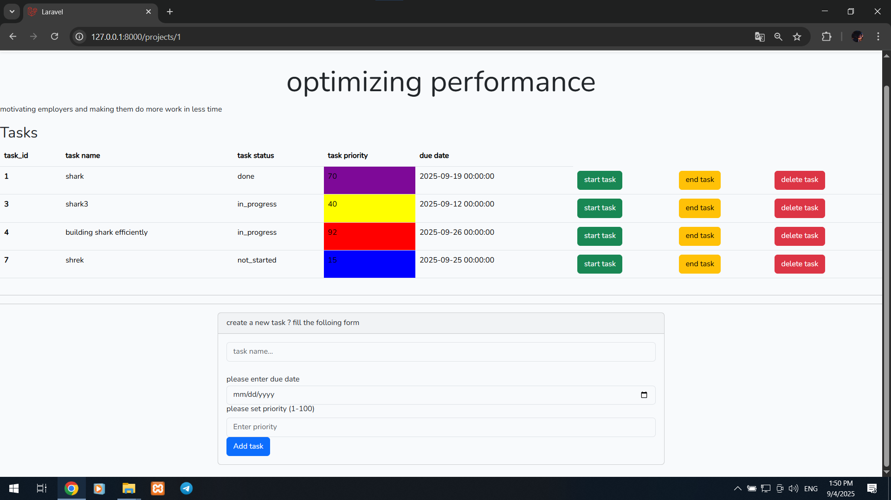
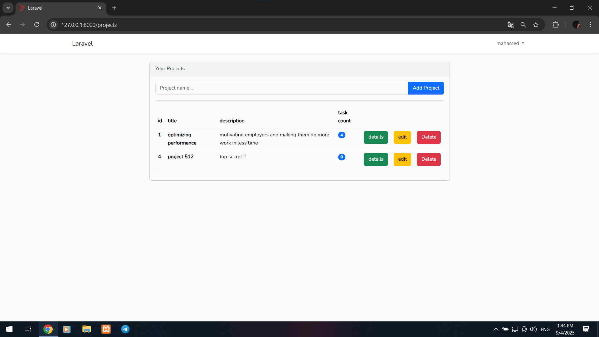

TaskFlow
A simple and intuitive task management web application built with Laravel. Organize your projects and tasks in one place.

https://img.shields.io/badge/PHP-8.0+-%2523777BB4?logo=php
https://img.shields.io/badge/Laravel-10.x-%2523FF2D20?logo=laravel
https://img.shields.io/badge/Bootstrap-5.x-%25237952B8?logo=bootstrap
https://img.shields.io/badge/MySQL-8.0-%25234479A1?logo=mysql

https://github.com/brucie2004/laravel-taskflow/tree/main/screenshots/projects.png
https://github.com/brucie2004/laravel-taskflow/tree/main/screenshots/tasks.png

✨ Features
User Authentication: Secure registration and login system.

Project Management: Create and manage multiple projects.

Task Tracking: Add tasks to your projects with statuses (Not Started, In Progress, Completed).

Clean Dashboard: View all your projects and tasks from a central dashboard.

Responsive Design: Built with Bootstrap, works well on desktop and mobile devices.

🛠️ Built With
Laravel - The PHP Framework For Web Artisans

Bootstrap - CSS Framework for responsive layouts

MySQL - Database

Composer - PHP Dependency Manager

📦 Installation
Follow these steps to set up the project locally on your machine.

Prerequisites:

PHP >= 8.0

Composer

MySQL

Node.js & NPM (for compiling assets)

Clone the repository:

bash
git clone https://github.com/brucie2004/laravel-taskflow.git
cd laravel-taskflow
Install PHP dependencies:

bash
composer install
Install NPM dependencies and compile assets:

bash
npm install
npm run build
Setup Environment:

Copy the .env.example file to .env

bash
cp .env.example .env
Generate an application key:

bash
php artisan key:generate
Configure your database connection in the .env file:

ini
DB_CONNECTION=mysql
DB_HOST=127.0.0.1
DB_PORT=3306
DB_DATABASE=taskflow
DB_USERNAME=root
DB_PASSWORD=
Run database migrations:

bash
php artisan migrate
Start the development server:

bash
php artisan serve
You can now access the application at http://localhost:8000.

🚀 Usage
Register a new account or log in.

Create a new Project from your dashboard.

Click on a project to view it and add Tasks.

Edit task statuses to keep track of your progress.

📸 Screenshots

🤝 Contributing
This is a personal learning project. However, suggestions and feedback are always welcome. Feel free to fork the project and submit pull requests.

📄 License
This project is open-source and is available under the MIT License.

👨‍💻 Author
Abod Shibany

GitHub: @brucie2004